# Running your Project
---

Be shure, your virtual environment is activated. If your virtual environment is not activated run 
```
pipen shell
```


Before run your application, verify the variables of the .env file are loaded. 


```
echo $FLASK_APP
echo $FLASK_DEBUG
echo $FLASK_ENV
echo $FLASK_RUN_PORT
echo $APP_DATABASE
echo $APP_SECRET
```

You must see the values save in your .env file.


When you see values in console,  run the command to start application
```
flask run
```

You must see in console something like that

```
* Serving Flask app "main.py" (lazy loading)
 * Environment: development
 * Debug mode: on
 * Running on http://127.0.0.1:5000/ (Press CTRL+C to quit)
 * Restarting with stat
 * Debugger is active!
 * Debugger PIN: 191-006-456

```

## Go to main page and set your credentials

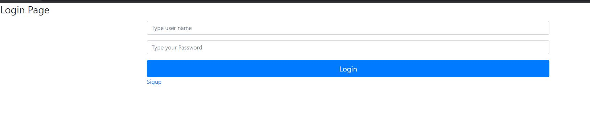


<br/>

If you sent nothing, you will be warn of empty fields 


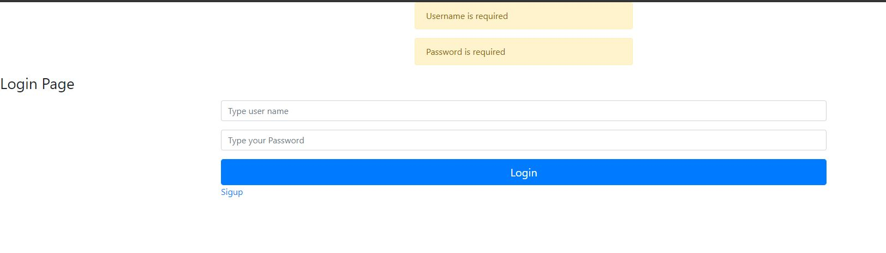


If your credential are invalid, you will be warn to correct them.
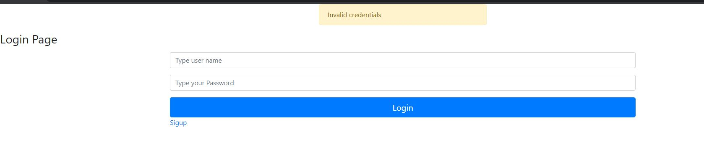


If you are not register use the link sigup
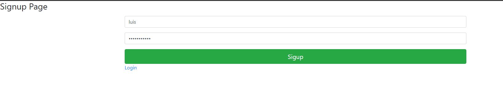


You only need a user(not taken) and password .
If you use a taken username you will be warn.

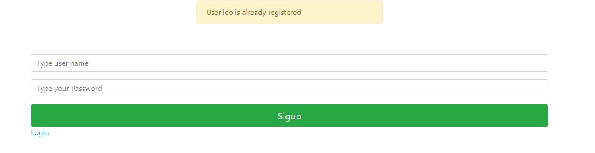

If signup was successfull you will be redirected to login page to use your credential.


After successfull login you will be redirected to you home page
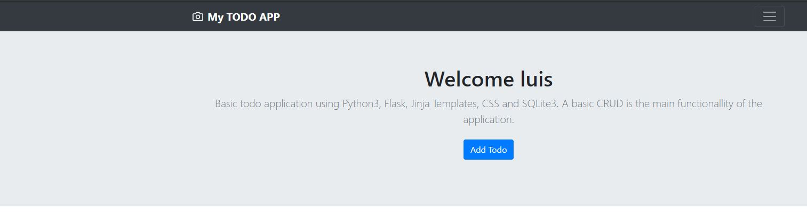


The application contains 3 versions of the frontend

1. Version 1. Uses just flask, and redirect in the pages.
2. Version 2. Uses a little bit of JavaScript, to load the todos. 
3. Version 3. Uses more JavaScript, and handle like a "Single One Page" application.

When you arrive in the home page, version 1 is by default. You can use version 1, cliking on My TODO APP logo.

For version 2 and 3 use the menu, and choose one version.

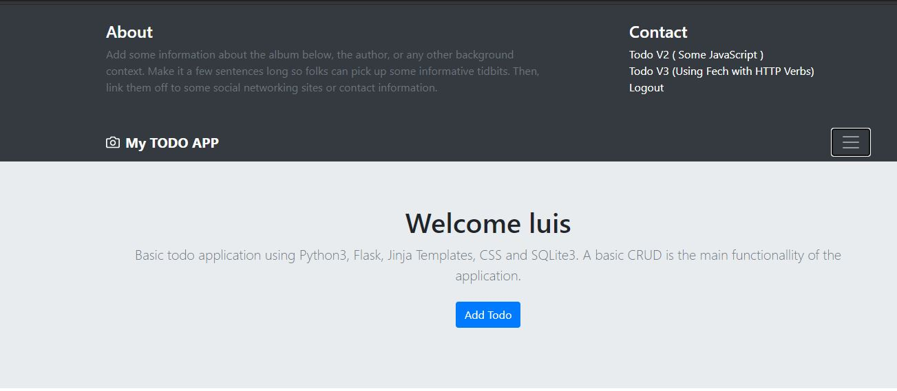


---

## Verion 1. Save, Update and Delete Todo


Clik on Add Todo button to go to save page

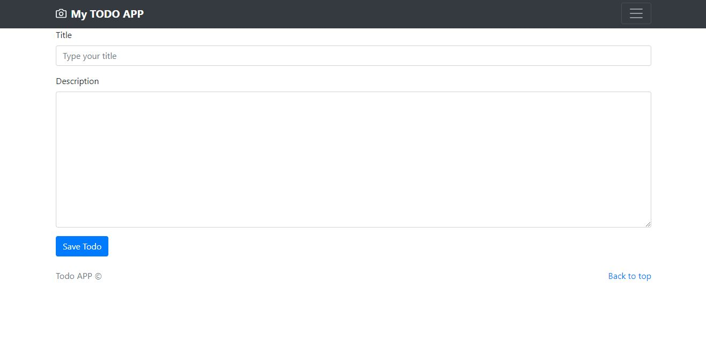


To add a new todo tipe title and description, both are required. If some field is missing, you will be warn.

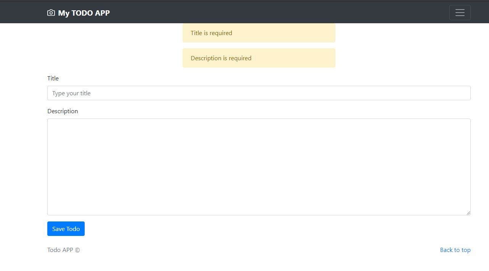


When the todo is successfully save, you will be redirected to main page and a flash will be sent.

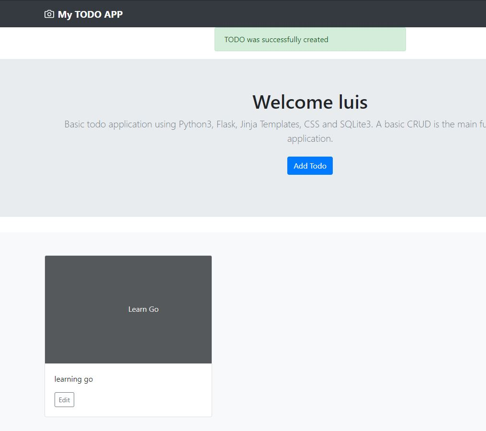


To edit  some todo, click on the Edit Button of the specific Todo. You will be redirected to update page.

In this page, you can chagtne title, description or change the status of the todo. Title and description are required.

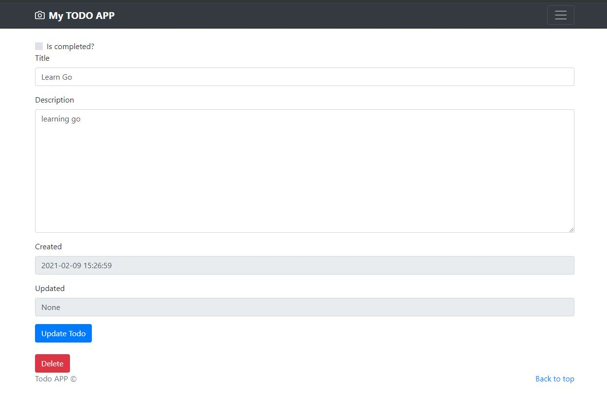


When you update the Todo, you will be redirected to home page and notified with a flash

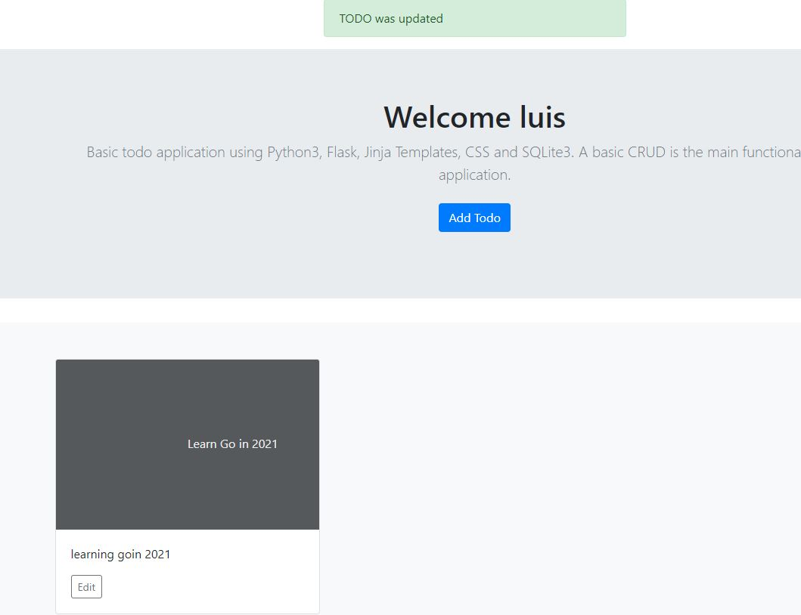


To delete some todo, click in the edit button  and you will be redirected to edit page. An clic the delete button. A confirm window will be sent, To continue with operation or cancel it.

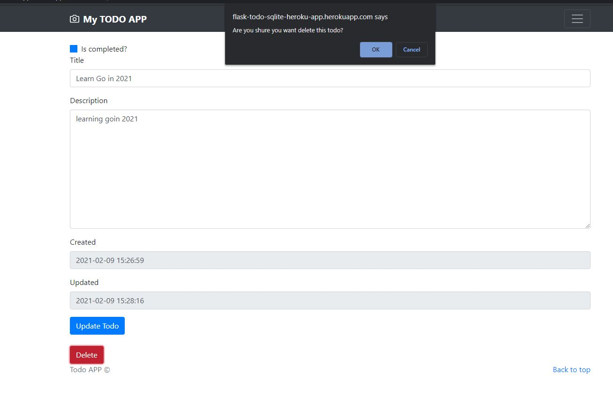


If you delete the todo you will be redirected to main page and a flash notify you about the action.

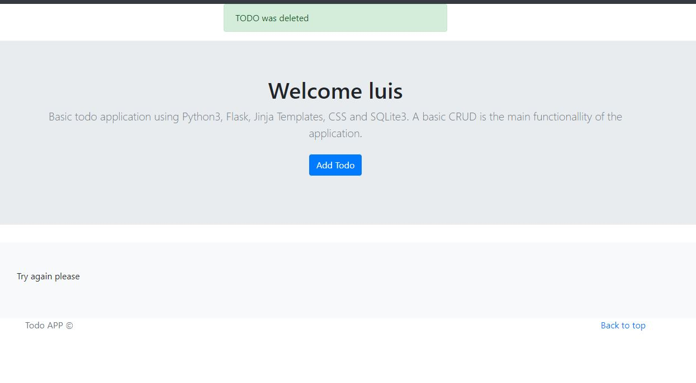


## Version 2
Version 2 it similar in many actions. But you have and additional button to show completed or pending todos. By default pending todos are shown and the button in color Green to change to completed todos. 

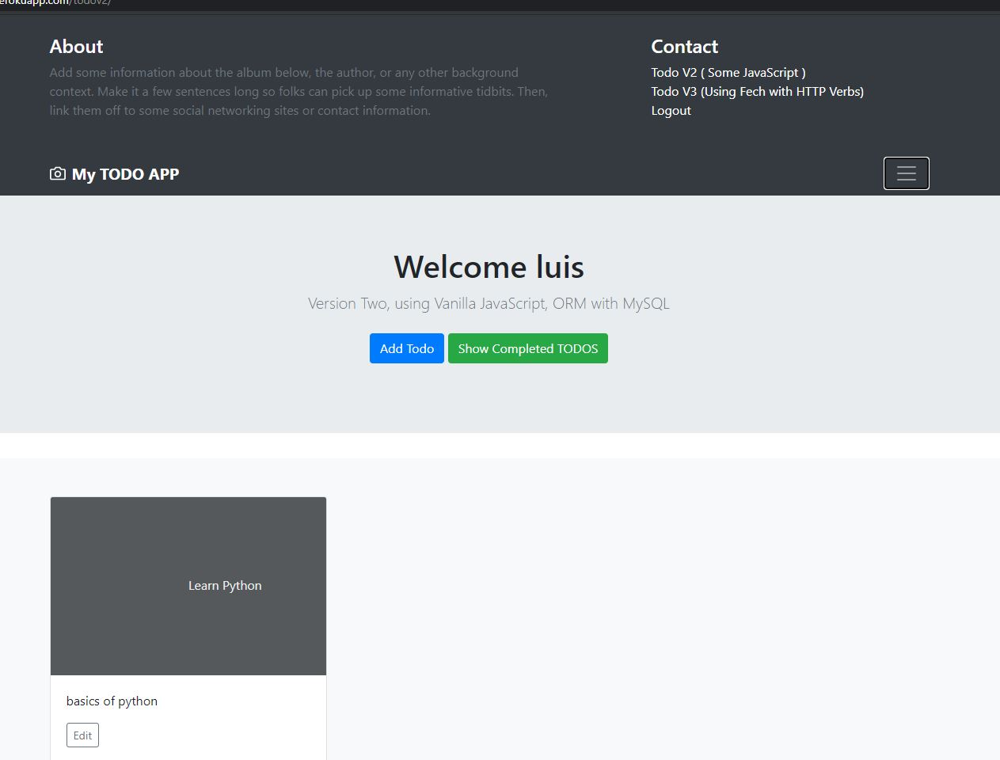

If you clien on green button (Show completed todos), the application show your completed todos and the color of the button change to yellow. When you click it, your completed todos will be listed.


## Version 3

Version 3 you can add the actions in the same page, and differents windows appear to complete some action.
The home page in version 3, is very similar to previous one.

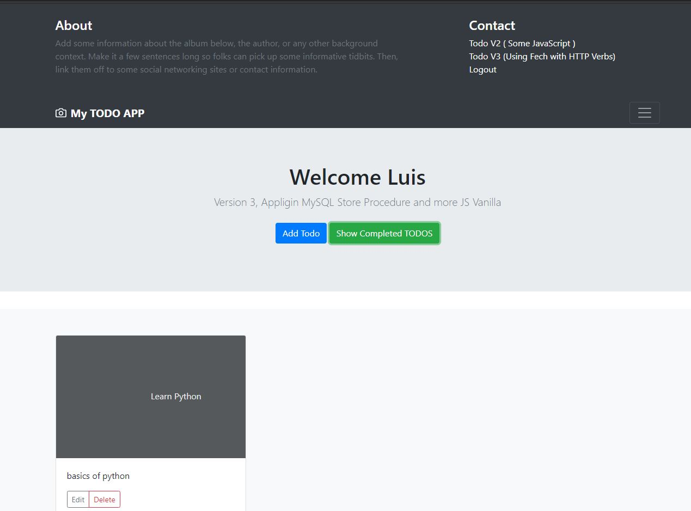


To add a new todo click on Add todo and a windows will apperar. 

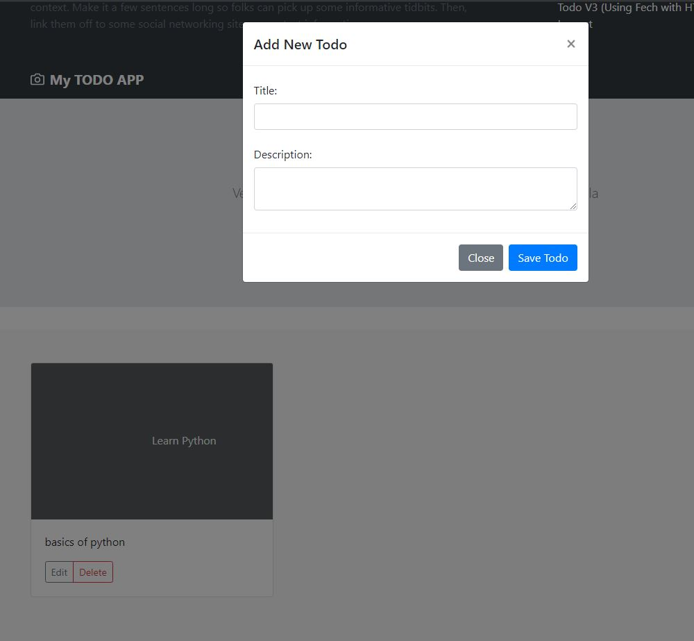


All fields are required. If someone is missing , the app notify you.

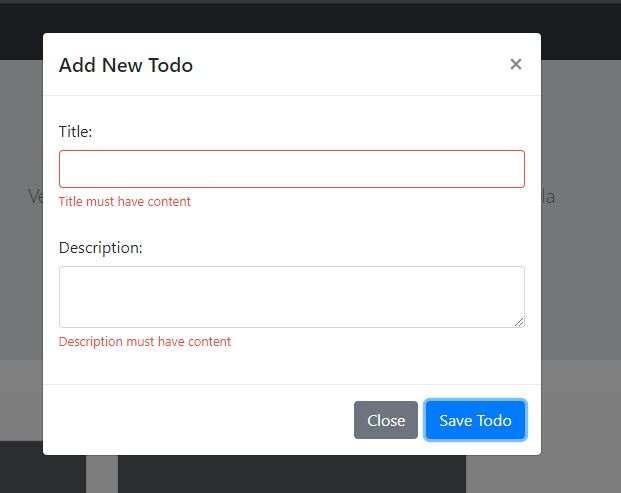

When you add a todo you will see the new todo in pending todos.

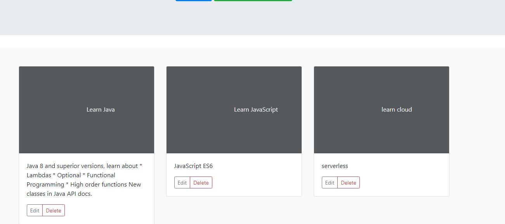


To update todo (title, description, status) cliek on edit button and a new windows appear.


To delete some todo, click directly in Delete button. A confirm windows appear to confirm or cancel operation.

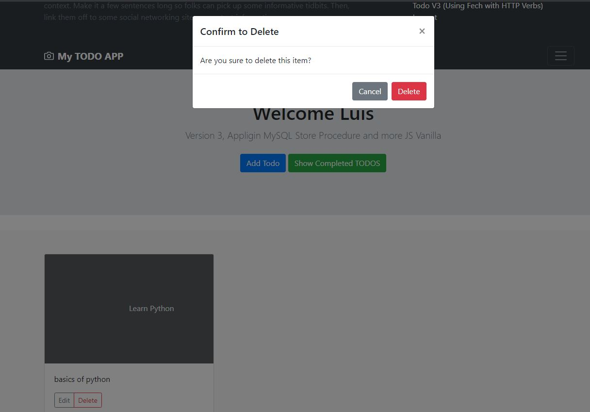
