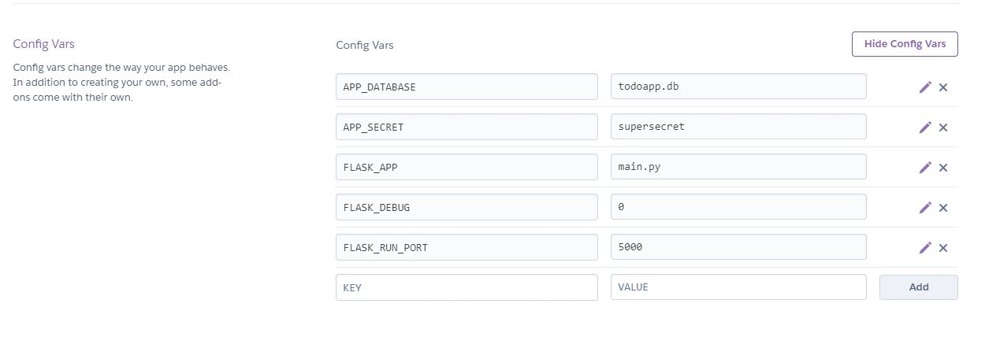

## Install gunicorn

```
pipenv install gunicorn
```

## Create Procfile
```
touch Procfile
```

## Edit Procfile to indicate the type of application and what file is the app, in this case is the file app.py
```
web: gunicorn app:app
```

## Create the requirements text file 
```
pipenv run pip freeze > requirements.txt
```

## setup or verify your git environment 

```
git init
git add .
git commit -m "Initial commit"
```

## Create a .slugignore, and add the files you want to ignore in the deployment
```
touch .slugignore
```

## login with heroku, a web browser will be open
```
heroku login
```

## Create an app with the heroku cli, and see the link to open the application dashboard
```
heroku create
```

## You can rename your app
```
heroku rename <new_amazing_name>
```
example
```
heroku rename flask-todo-sqlite-heroku-app
```

Go to Heroku panel  and select you application


Go to configuration, and revela config vars


And set the values you required.




## Deploy the app to heroku, 
```
git push heroku main
```

The display messages will be something like that
```
Enumerating objects: 71, done.
Counting objects: 100% (71/71), done.
Delta compression using up to 8 threads
Compressing objects: 100% (65/65), done.
Writing objects: 100% (71/71), 34.44 KiB | 3.83 MiB/s, done.
Total 71 (delta 9), reused 0 (delta 0)
remote: Compressing source files... done.
remote: Building source:
remote: 
remote: -----> Building on the Heroku-20 stack
remote: -----> Deleting 8 files matching .slugignore patterns.
remote: -----> Python app detected
remote: -----> Installing python-3.6.12
remote: -----> Installing pip 20.1.1, setuptools 47.1.1 and wheel 0.34.2
remote: -----> Installing SQLite3
remote: -----> Installing requirements with pip
remote:        Collecting blinker==1.4
remote:          Downloading blinker-1.4.tar.gz (111 kB)
remote:        Collecting click==7.1.2
remote:          Downloading click-7.1.2-py2.py3-none-any.whl (82 kB)
remote:        Collecting dominate==2.6.0
remote:          Downloading dominate-2.6.0-py2.py3-none-any.whl (29 kB)
remote:        Collecting Flask==1.1.2
remote:          Downloading Flask-1.1.2-py2.py3-none-any.whl (94 kB)
remote:        Collecting Flask-Bootstrap4==4.0.2
remote:          Downloading Flask_Bootstrap4-4.0.2-py3-none-any.whl (1.7 MB)
remote:        Collecting Flask-Testing==0.8.1
remote:          Downloading Flask-Testing-0.8.1.tar.gz (45 kB)
remote:        Collecting Flask-WTF==0.14.3
remote:          Downloading Flask_WTF-0.14.3-py2.py3-none-any.whl (13 kB)
remote:        Collecting gunicorn==20.0.4
remote:          Downloading gunicorn-20.0.4-py2.py3-none-any.whl (77 kB)
remote:        Collecting itsdangerous==1.1.0
remote:          Downloading itsdangerous-1.1.0-py2.py3-none-any.whl (16 kB)
remote:        Collecting Jinja2==2.11.3
remote:          Downloading Jinja2-2.11.3-py2.py3-none-any.whl (125 kB)
remote:        Collecting MarkupSafe==1.1.1
remote:          Downloading MarkupSafe-1.1.1-cp36-cp36m-manylinux2010_x86_64.whl (32 kB)
remote:        Collecting python-dotenv==0.15.0
remote:          Downloading python_dotenv-0.15.0-py2.py3-none-any.whl (18 kB)
remote:        Collecting visitor==0.1.3
remote:          Downloading visitor-0.1.3.tar.gz (3.3 kB)
remote:        Collecting Werkzeug==1.0.1
remote:          Downloading Werkzeug-1.0.1-py2.py3-none-any.whl (298 kB)
remote:        Collecting WTForms==2.3.3
remote:          Downloading WTForms-2.3.3-py2.py3-none-any.whl (169 kB)
remote:        Building wheels for collected packages: blinker, Flask-Testing, visitor
remote:          Building wheel for blinker (setup.py): started
remote:          Building wheel for blinker (setup.py): finished with status 'done'
remote:          Created wheel for blinker: filename=blinker-1.4-py3-none-any.whl size=13452 sha256=e080e61f5374784e440a201acafe700c2b9e729b477e6d3c1ea8cb8bcd75c302
remote:          Stored in directory: /tmp/pip-ephem-wheel-cache-sr3yb03o/wheels/4f/4a/93/c5ed8c11fedbe97fb8b8032b301eaa736248684b44087a7259
remote:          Building wheel for Flask-Testing (setup.py): started
remote:          Building wheel for Flask-Testing (setup.py): finished with status 'done'
remote:          Created wheel for Flask-Testing: filename=Flask_Testing-0.8.1-py3-none-any.whl size=8175 sha256=7d0050299c3a836f8d1749bf1bcb8d5132afe5ff83f4919fd724dfe6f2125b26
remote:          Stored in directory: /tmp/pip-ephem-wheel-cache-sr3yb03o/wheels/b5/f2/5b/cc225223d2b06cfc177bc247b33fe7df9a9eefb3b37a11d11b
remote:          Building wheel for visitor (setup.py): started
remote:          Building wheel for visitor (setup.py): finished with status 'done'
remote:          Created wheel for visitor: filename=visitor-0.1.3-py3-none-any.whl size=3931 sha256=24408bf3d9aad9192af94957fe9023b3a0783cb926f413bdd6b1eb1f97bf62e3
remote:          Stored in directory: /tmp/pip-ephem-wheel-cache-sr3yb03o/wheels/a9/77/93/3b8a22ac46f57a22d0fd7b4912fff740bcbddbd720bd48508e
remote:        Successfully built blinker Flask-Testing visitor
remote:        Installing collected packages: blinker, click, dominate, itsdangerous, Werkzeug, MarkupSafe, Jinja2, Flask, visitor, Flask-Bootstrap4, Flask-Testing, WTForms, Flask-WTF, gunicorn, python-dotenv
remote:        Successfully installed Flask-1.1.2 Flask-Bootstrap4-4.0.2 Flask-Testing-0.8.1 Flask-WTF-0.14.3 Jinja2-2.11.3 MarkupSafe-1.1.1 WTForms-2.3.3 Werkzeug-1.0.1 blinker-1.4 click-7.1.2 dominate-2.6.0 gunicorn-20.0.4 itsdangerous-1.1.0 python-dotenv-0.15.0 visitor-0.1.3
remote: -----> Discovering process types
remote:        Procfile declares types -> web
remote: 
remote: -----> Compressing...
remote:        Done: 50.3M
remote: -----> Launching...
remote:        Released v3
remote: 
remote: Verifying deploy... done.
```


## get info of you application with
```
heroku apps:info
```
